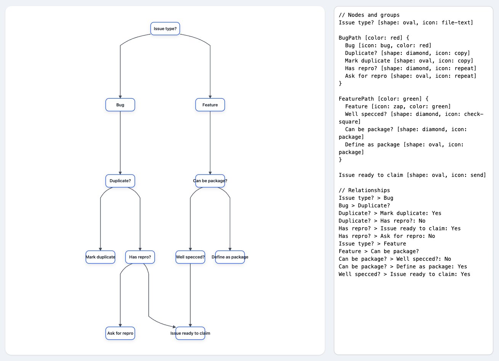

# Eraser-DSL OMG SO FANCY



[Live Demo](https://davidyen1124.github.io/eraser-dsl-omg-so-fancy/)

Welcome to the most unnecessarily fancy flowchart DSL demo you never asked for! 🎉

## What is this?

A web app that lets you write a weirdly simple DSL to make flowcharts, because drawing boxes with a mouse is so 2022. Powered by DagreJS, D3, and a healthy disregard for productivity.

## Features

- **Live preview**: Because you need to see your mistakes instantly.
- **Groups and nodes**: Organize your thoughts, or just pretend to.
- **Arrows**: For when you want to point fingers.
- **Tailwind CSS**: Because why not?
- **Zero backend**: The only thing lighter than this app is your will to document your process.

## How do I use it?

1. Open `index.html` in your browser.
2. Type some DSL in the right panel. (Or just stare at the sample, that's fine too.)
3. Watch the magic happen on the left. Or don't. I'm not your boss.

## Example DSL

```
Issue type? [shape: oval, icon: file-text]
BugPath [color: red] {
  Bug [icon: bug, color: red]
  Duplicate? [shape: diamond, icon: copy]
}
Issue type? > Bug
```

## Why does this exist?

Because someone, somewhere, thought, "What if flowcharts, but with more typing?"

## Contributing

PRs welcome, but only if you can out-sarcasm this README.

## License

See `LICENSE` if you dare.
